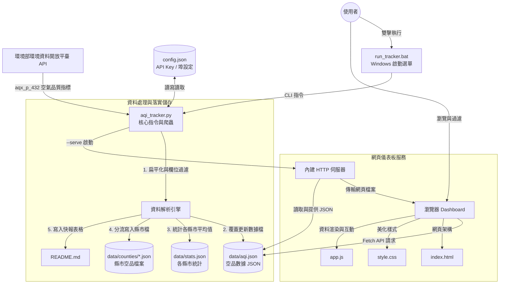

# 台灣空氣品質追蹤器 | 系統架構說明書 (System Architecture)

本專案是一個輕量化、無外部依賴的台灣空氣品質資料抓取、統計與視覺化監測系統。本文件詳細說明了系統架構、元件關係與資料流向。

---

## 🏗️ 系統架構概覽

本系統採用 **Pipeline 爬蟲存檔** 與 **SPA (Single Page Application) 本地玻璃擬態儀表板** 結合的雙層架構，元件間透過 JSON 檔案進行鬆耦合（Loose Coupling）通訊。

### 核心設計原則：
1.  **無外部依賴 (Zero Dependency)**：Python 腳本完全使用內建的 `urllib` 與 `http.server`，不需安裝第三方套件（如 `requests` 或 `flask`），開箱即用。
2.  **單一檔案歷史控管 (Single-File History)**：抓取資料時僅輸出為單一檔案 `data/aqi.json`。透過 Git 進行檔案的版本變更管理，保持工作目錄的極度簡潔。
3.  **防衝突埠設計 (Resilient Port Binding)**：本地伺服器內建自動埠掃描，當 Port 8800 被佔用時，自動尋找下一個可用 Port，避免服務無法啟動。
4.  **歷史與分區統計 (Local & Statistics Tracking)**：保存全台測站最新數據的同時，在 `data/counties/` 下為全台 22 縣市建立獨立的即時空品資料，並更新 `README.md` 的統計表格與快報。

---

## 📊 系統資料流與元件互動 (Data Flow)

以下是資料從環境部 OpenAPI 延伸到使用者瀏覽器的互動圖：



---

## 🧩 核心元件說明 (Component Breakdown)

| 元件名稱 | 檔案路徑 | 職責與描述 |
| :--- | :--- | :--- |
| **主控制台** | `aqi_tracker.py` | 負責處理命令列參數（`--fetch`, `--serve` 等）、讀取 `config.json`，並實作爬蟲抓取、資料流寫入以及 HTTP Server。 |
| **設定中心** | `config.json` | 儲存 API 授權碼、輸出路徑與預設埠號。若檔案不存在，主控制台會自動模板化建立。 |
| **啟動器** | `run_tracker.bat` | 提供 Windows 使用者簡易的互動式 DOS 選單，可雙擊執行，無須記住 Python 命令列指令。 |
| **數據檔 (唯一)** | `data/aqi.json` | 爬蟲將環境部原始資料扁平化萃取為只包含 `測站編號, 測站名稱, 縣市, AQI, 狀態, 污染物, PM2.5, PM10, O3, CO, SO2, NO2, 風速, 風向, 座標` 等欄位的精簡 JSON。前端會讀取此檔。 |
| **統計檔** | `data/stats.json` | 保存全台空品狀況、健康狀態分布站數，以及各縣市的平均 AQI 統計，供前端或 README 使用。 |
| **分區資料** | `data/counties/*.json` | 將全台測站依縣市拆分，寫入各縣市對應的專屬空品資料檔。 |
| **儀表板視圖** | `index.html` | 單頁應用 (SPA) 結構，預留搜尋欄、狀態篩選 Tab、縣市下拉選單、測站清單、詳細資訊卡片、化學成分濃度格與風向羅盤。 |
| **視覺特效** | `style.css` | 採用暗色系（Dark Theme）毛玻璃設計，運用 CSS 漸變、陰影、自訂滾動條與微動畫，建立高級視覺感受。 |
| **交互控制** | `app.js` | 動態拉取 JSON，根據縣市地區進行分類過濾，將 AQI 數值與氣象指標渲染為精美的 UI 卡片，且支援風向指標旋轉之微動畫。 |

---

## 💾 資料儲存結構

當系統執行 `--fetch` 後，資料將按以下層級妥善保管：

```text
taiwan-air-quality/
├── data/
│   ├── aqi.json                           # 全國測站最新空氣品質數據檔案
│   ├── stats.json                         # 全台統計與縣市平均數據
│   └── counties/
│       ├── 臺北市.json                     # 各縣市專屬之測站歷史與即時數據
│       ├── 新北市.json
│       └── ...
```

---

## 🔄 核心運作邏輯 (Execution Flows)

### 1. 爬蟲抓取流程 (Fetch Flow)
1. 讀取 `config.json`，檢查 API Key 是否有效（若無則使用預設公開測試 Key）。
2. 發送 HTTPS GET 請求至環境部開放資料平台 API 抓取空氣品質監測資料。
3. 呼叫 `parse_aqi()` 將取得的資料結構解析為扁平 JSON 項目，並按縣市與測站字母排序。
4. 覆蓋更新儲存至 `data/aqi.json`。
5. 統計各縣市平均值與狀態分布，寫入 `data/stats.json`。
6. 分流各測站資料至 `data/counties/{縣市}.json`。
7. 更新 `README.md` 中的全台空品快報與統計表格。

### 2. 伺服器啟動流程 (Serve Flow)
1. 讀取 `config.json` 中的 `server_port`（預設 8800）。
2. 嘗試建立 `TCPServer` 綁定埠號。
3. 若發生 `OSError` 且為 `Address already in use`，則自動 `port + 1` 再次嘗試。
4. 重複嘗試最多 20 次，成功後啟動 HTTP 服務。
5. 調用系統預設瀏覽器打開 `http://localhost:{port}/index.html`。
